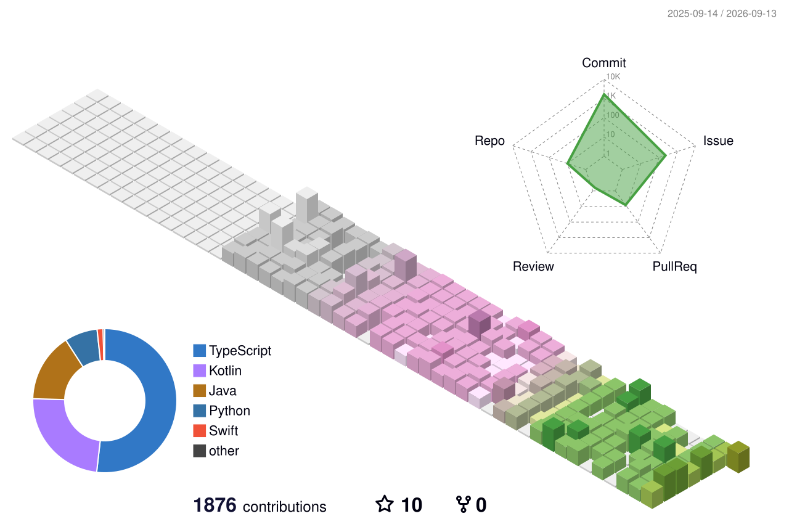

<!--
  ╭─────────────────────────────────────────────────────────────╮
  │  GitHub プロフィール README  ―  権イゴン / Kwon Yigun         │
  │  置き場所:  リポジトリ  2daKaizen-gun/2daKaizen-gun          │
  │            (アカウント名と同じ名前・Public・README.md)        │
  │  3D グラフを出すには profile-3d.yml も一緒に入れてください    │
  ╰─────────────────────────────────────────────────────────────╯
-->

# 権イゴン ・ Kwon Yigun

**韓国と日本を、AI とコードでつなぐ。**
Bridging Korea and Japan with AI and code.
한국과 일본을, AI와 코드로 잇습니다.

*機械が見落とす所を、測って確かめる開発が好きです ― 派手さより、検証できる正直さを。*
*I like building for the places machines miss — and proving it, not just claiming it.*

---

## 🌏 自己紹介 ・ About

- 🎓 **漢城大学（ハンソン大学）コンピュータ工学科 在学** ・ CS @ Hansung University, Seoul
- 🇯🇵 **2027年 京都府立大学 交換留学 準備中**、日本での就職を目指しています ・ Exchange at Kyoto Prefectural University (2027), aiming to work in Japan
- 🎯 志望 ・ Focus : **AI** ・ **フルスタック / Full-stack**
- 🗣 言語 ・ Languages : 日本語 **JLPT N2** ・ English ・ 한국어(母語)
- 🧭 つくるテーマ ・ What I build around :
  **① 韓国と日本をつなぐ** ・ **② AI で手作業を自動化** ・ **③ 検証できる正直なプロダクト**

> 3つのテーマは別々のアイデアではなく、同じ動機の3つの面です ―
> 「二つの文化のあいだの摩擦を、コードで滑らかにしたい」。
> Not three separate ideas but three faces of one motive: *smoothing the friction between two cultures with code.*

---

## 🛰 制作物 ・ Featured Projects

<!-- 採用担当が一番見る所。日本市場向けの3本を代表作として前に。 -->

### 🇯🇵 KOTONA — 「言葉」ではなく「本音」を読み解く
> ビジネス日本語の **本音 / 建前** を AI が解析し、非ネイティブのエンジニアに敬語・間接表現・礼儀スコアと返信戦略を提示するプロダクト。
> An AI analyzer that reads the *honne* (true intent) behind the *tatemae* (public face) of business Japanese — politeness / indirectness / etiquette scores and response strategies for non-native engineers.

- **技術 / Stack** : `Java` `Spring Boot` `Next.js` `TypeScript` `Gemini (Google GenAI)` `MySQL` `Docker` `GitHub Actions → AWS EC2`
- **役割 / Role** : 個人開発（バックエンド `kotona-analyzer` ＋ フロント `kotona-web` の2リポジトリ）
- **見どころ / Highlights** :
  - 本音/建前を分離し、Red Flag と対処法まで提示。返信は Standard / Soft / Firm の3段階生成
  - スキーマ強制 JSON で Gemini 出力を安定化。`docker compose up` 一発起動＋CI/CD で EC2 デプロイ
- 🔗 [kotona-analyzer](https://github.com/2daKaizen-gun/kotona-analyzer) ・ [kotona-web](https://github.com/2daKaizen-gun/kotona-web)

### 🌌 Pale Blue Code — 系外惑星ハンター
> TESS 衛星の **実観測データ** から、まだ誰もカタログに載せていない惑星候補を単一トランジット法で探すフルスタックアプリ。自動パイプラインが盲目になる領域を狙う。
> Hunts *uncatalogued* exoplanet candidates in real TESS light curves — the single-transit regime where automated pipelines go blind.

- **技術 / Stack** : `React` `TypeScript` `Three.js` `GLSL` `FastAPI` `Python` `NumPy` `lightkurve` `astroquery`
- **役割 / Role** : 個人開発（設計・実装・検証すべて）
- **見どころ / Highlights** :
  - 5つの形状ゲート(edge / coherence / flare / symmetry / baseline)で計器由来の偽検出を棄却 ―「有意性は必要条件、十分条件ではない」
  - 各星の **実測感度** から「本当に見えたはずの最小惑星サイズ」を算出する正直な null。テスト pytest 195 / vitest 217
- 🔗 [Repository](https://github.com/2daKaizen-gun/pale-blue-code)

### 📱 冴え (Sae) — 90秒で脳の冴えを測る
> ウェアラブル不要。反応時間テスト(PVT)で「睡眠負債」による脳の覚醒度を毎日 0–100 で可視化する iOS ネイティブアプリ。自社開発企業向けポートフォリオ。
> A native iOS app that turns the science-grade PVT reaction-time test into a daily 0–100 alertness score — no wearable needed.

- **技術 / Stack** : `Swift` `SwiftUI` `HealthKit` `CoreMotion` `CADisplayLink`  ・ i18n : JA / EN / KO
- **役割 / Role** : 個人開発
- **見どころ / Highlights** :
  - `CADisplayLink` フレーム時刻と `UITouch.timestamp` でミリ秒精度の反応時間計測（表示・処理遅延を混入させない）
  - 0–100 スコアは全て生の PVT 指標に遡れる **説明可能な設計**（ブラックボックスにしない）
- 🔗 [Repository](https://github.com/2daKaizen-gun/sae)

---

## 🧩 その他のプロジェクト ・ More

| Project | 一言 / What | Stack |
|---|---|---|
| **SkyWear** | 🇰🇷🇯🇵 韓日の気温差を8段階の服装提案に変える Android 旅行アプリ | `Kotlin` `Android` `OpenWeatherMap` `Firebase` |
| **JP-KR Schedule Bridge** | 韓日の祝日を同期し、Gemini で敬語ビジネスメールを自動起草 | `Next.js` `TypeScript` `Gemini` `Google Calendar API` |
| **JP-Dictionary-Bot** | JLPT レベル別・IT/ビジネス文脈の語彙を Gemini 解析して Notion へ同期 | `Python` `Streamlit` `Gemini` `Notion API` |
| **survey-auto-summarizer** | 大学の国際交流アンケートを Gemini で多言語横断分析し自動レポート化 | `Python` `Gemini` `Google Sheets API` |

---

## 🧰 技術スタック ・ Tech Stack

**Language**

**Frontend**

**Backend / Mobile**

**AI / Infra**

---

## 📊 活動・習慣 ・ Activity & Habits

<!-- 3D コミットカレンダー : profile-3d.yml が毎日生成 -->

 

<!-- 統計・言語・習慣を1枚に : metrics.yml がリポジトリ内で生成（外部サーバー非依存で常に安定） -->

<!--
  習慣が「見える」ポイント：
  ・isocalendar = 一年のコミット密度を等角カレンダーで
  ・habits      = いつ・どれだけ書くか（作業リズム＝継続力の証拠）
  ・languages   = 使用言語の内訳
  すべて自分のリポジトリ内で生成されるSVGなので、共有サーバーの不調に左右されない。
-->

---

*「派手な発見より、検証できる正直さを。」*
*Not a flashy discovery — an honest one you can check.*
*화려한 발견보다, 검증할 수 있는 정직함을.*

